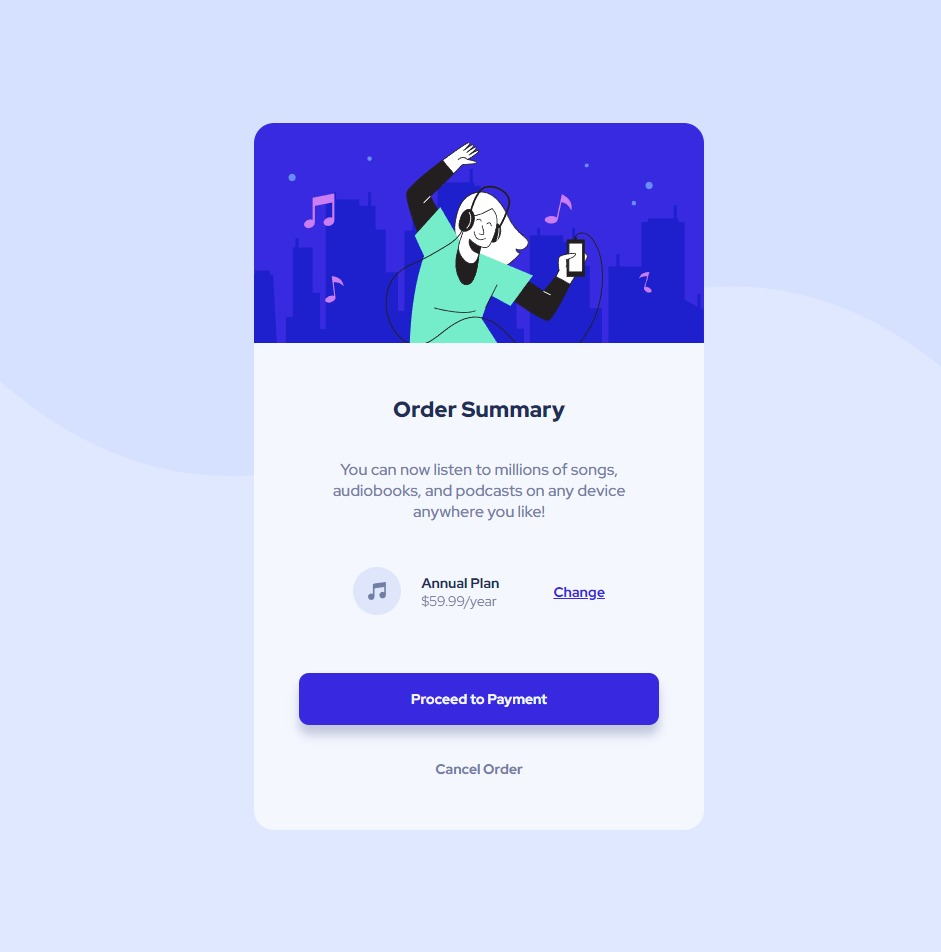

# Frontend Mentor - Order summary card solution

This is a solution to the [Order summary card challenge on Frontend Mentor](https://www.frontendmentor.io/challenges/order-summary-component-QlPmajDUj) 

## Table of contents

- [The challenge](#the-challenge)
- [Screenshot](#screenshot)
- [Links](#links)
- [Built with](#built-with)
- [What I learned](#what-i-learned)
- [Author](#author)


### The challenge

Users should be able to:

- See hover states for interactive elements

### Screenshot



### Links

- Solution URL:
- Live Site URL: 

## My process

### Built with

- Semantic HTML5 markup
- CSS custom properties
- Flexbox

### What I learned

Setting the background image was interesting. 

```css
body {
  display: flex;
  height: 100vh;
  justify-content: center;
  align-items: center;
  background-color: $primary-pale-blue;
  background-image: url("../images/pattern-background-desktop.svg");
  background-position: top;
  background-size: 100% 50%;
  background-repeat: no-repeat;
  font-family: $font-family;
}
```

## Author

- Frontend Mentor - https://www.frontendmentor.io/profile/DanielDeaconescu
